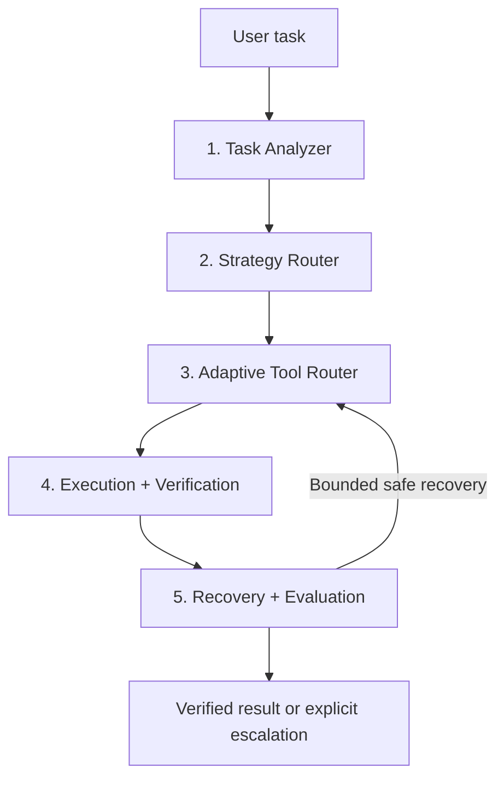

# Orqen

**Adaptive Agent Orchestrator**

Orqen is a proposed orchestration engine that helps agents choose an execution strategy, discover relevant tools, validate calls, verify outcomes, and recover from failures within explicit limits.

Orqen includes a working modular Python SDK with deterministic routing, dependency-aware execution, JSON Schema validation, application-owned permissions, task verification, and bounded read recovery. An optional Ollama transport is available with offline contract tests; live model compatibility is not yet verified. Multi-agent execution is not implemented.

The current focus is a small contract-enforcing execution and evaluation layer. The original adaptive-orchestration concept remains a research hypothesis; see the [independent review and revised direction](docs/research-review.md).

```powershell
python -m venv .venv
.\.venv\Scripts\python.exe -m pip install -e ".[dev]"
.\.venv\Scripts\python.exe examples/customer_workflow.py
.\.venv\Scripts\python.exe -m pytest -q
.\.venv\Scripts\python.exe -m orqen.cli evaluate --repetitions 5 --seed 17
.\.venv\Scripts\python.exe -m orqen.cli evaluate-catalog
```

See the [SDK guide](docs/sdk.md) for integration examples and execution limits.

## Architecture



1. **Task Analyzer:** identify task type, complexity, dependencies, risk, and missing information.
2. **Strategy Router:** select direct response, function calling, plan-and-execute, or multi-agent execution where justified.
3. **Adaptive Tool Router:** retrieve relevant tools and validate required arguments and permissions.
4. **Execution + Verification:** execute within budgets and check both tool results and task completion conditions.
5. **Recovery + Evaluation:** classify failures, attempt safe bounded recovery, and record outcomes and overhead.

## Research foundation

Inspired by [AgentArch: A Comprehensive Benchmark to Evaluate Agent Architectures in Enterprise](https://arxiv.org/abs/2509.10769), by Tara Bogavelli, Roshnee Sharma, and Hari Subramani. First submitted September 13, 2025; revised January 6, 2026. See the [official ServiceNow repository](https://github.com/ServiceNow/AgentArch).

AgentArch evaluates architectural configurations in enterprise workflows. Its task- and model-dependent findings motivate our hypothesis: selecting orchestration strategies and tool sets according to task requirements may improve reliability and efficiency over a fixed architecture.

Orqen is an independent project, not an AgentArch implementation. Its local fault suite checks executor behavior; no AgentArch results or real model performance improvements have been established.

## Project documents

- [Architecture and implementation boundaries](docs/architecture.md)
- [Python SDK usage](docs/sdk.md)
- [Structured planning and catalog policies](docs/planning.md)
- [Optional Ollama model connection](docs/ollama.md)
- [Controlled evaluation plan](docs/evaluation.md)
- [Independent research and architecture review](docs/research-review.md)
- [Measured local fault-suite results](docs/local-results.md)
- [Catalog coverage results and failures](docs/catalog-results.md)
- [Development milestones](docs/roadmap.md)
- [Completion plan and owner inputs](docs/completion-plan.md)

## Development workflow

Use `orqen` as the project and Python package name. Commit each major completed milestone after its relevant checks pass. Current instruction: keep commits local; do not push until explicitly authorized again. Keep secrets, local environments, and raw execution data out of Git.
